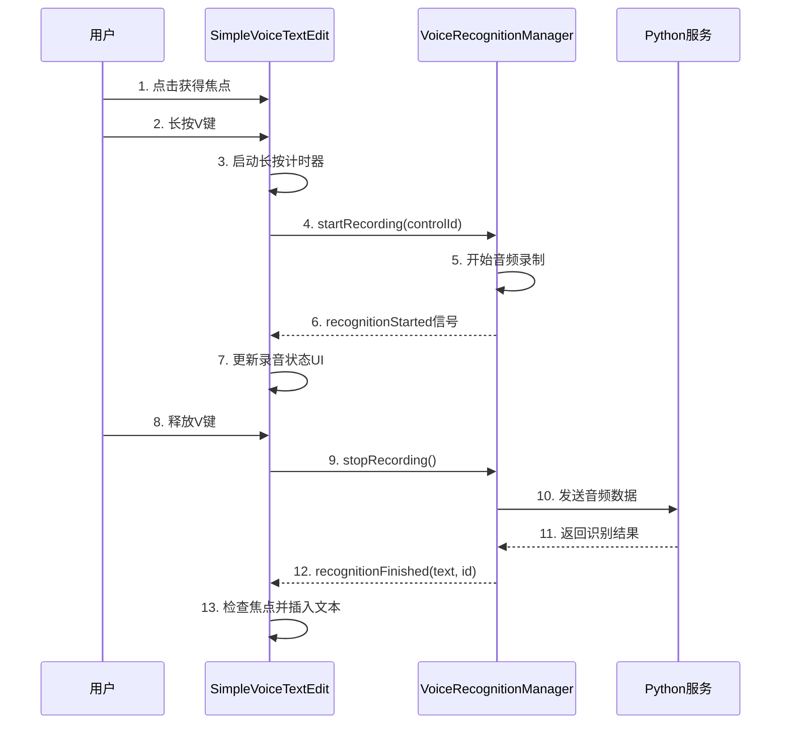

# 🎤 语音输入Qt应用重构方案总结

## 📋 重构目标

将语音识别逻辑从UI控件中分离，实现：
- **单一职责原则**：UI控件专注于交互，业务逻辑独立处理
- **多控件支持**：多个文本框共享一个语音识别服务
- **线程安全**：网络请求在独立线程中处理
- **焦点智能**：基于焦点的文本投递机制

## 🏗️ 新架构设计

### **核心组件**

#### 1. **VoiceRecognitionManager** - 语音识别管理器
- **设计模式**：单例模式，全局唯一实例
- **运行方式**：独立QThread线程处理
- **职责**：
  - 音频录制和处理
  - 网络请求管理
  - 识别结果解析
  - 全局状态广播

#### 2. **SimpleVoiceTextEdit** - 简化版文本编辑器
- **设计原则**：只管UI交互，不处理业务逻辑
- **职责**：
  - 键盘事件监听（V键长按）
  - 焦点状态管理
  - 视觉状态更新
  - 文本插入显示

#### 3. **信号通信机制**
- **全局广播**：VoiceRecognitionManager发出信号
- **智能接收**：只有焦点控件处理识别结果
- **状态同步**：所有控件同步状态显示

## 📁 文件结构

### **新增文件**
```
APP/
├── voicerecognitionmanager.h      # 语音识别管理器头文件
├── voicerecognitionmanager.cpp    # 语音识别管理器实现
├── simplevoicetextedit.h          # 简化版文本编辑器头文件
├── simplevoicetextedit.cpp        # 简化版文本编辑器实现
├── multivoicedemo.h               # 多控件演示头文件
└── multivoicedemo.cpp             # 多控件演示实现
```

### **修改文件**  
```
APP/
├── APP.pro                        # 项目文件：添加新源文件
├── mainwindow.h                   # 主窗口头文件：更新类型声明
└── mainwindow.cpp                 # 主窗口实现：使用新架构
```

## 🔄 交互流程



## ⚡ 核心优势

### **1. 架构解耦**
- UI层和业务层完全分离
- 便于单元测试和维护
- 支持不同UI控件复用同一服务

### **2. 多控件支持**
- 一个管理器服务多个文本框
- 基于焦点的智能文本投递
- 状态信息统一管理

### **3. 线程安全**
- 网络请求在工作线程中处理
- UI操作在主线程中执行
- 通过信号槽保证线程安全

### **4. 扩展性强**
- 易于添加新的文本控件类型
- 可以支持不同的语音识别服务
- 便于添加新功能（如语音指令）

## 🎯 使用场景示例

### **单控件场景**
```cpp
// 在MainWindow中使用
SimpleVoiceTextEdit* textEdit = new SimpleVoiceTextEdit(this);
setCentralWidget(textEdit);

// 初始化管理器
VoiceRecognitionManager::instance()->initialize();
```

### **多控件场景**
```cpp
// 创建多个控件
SimpleVoiceTextEdit* edit1 = new SimpleVoiceTextEdit();
SimpleVoiceTextEdit* edit2 = new SimpleVoiceTextEdit(); 
SimpleVoiceTextEdit* edit3 = new SimpleVoiceTextEdit();

// 共享同一个语音识别服务
// 焦点控件自动接收识别结果
```

## 🔧 编译说明

### **1. 更新项目文件**
APP.pro已更新，包含所有新文件

### **2. 编译步骤**
```bash
cd APP
qmake APP.pro
make clean && make
```

### **3. 运行测试**
```bash
# 启动Python服务
cd ../SenseVoice
python start_service.py

# 运行Qt应用
cd ../APP
./APP
```

## 📊 性能对比

| 特性 | 旧架构 | 新架构 |
|------|--------|---------|
| 多控件支持 | ❌ 每个控件独立处理 | ✅ 共享服务，智能投递 |
| 线程安全 | ⚠️ UI线程阻塞 | ✅ 独立工作线程 |
| 代码复用 | ❌ 重复的识别逻辑 | ✅ 单一识别服务 |
| 内存占用 | 🔴 每控件一套网络组件 | 🟢 全局共享组件 |
| 扩展性 | ⚠️ 修改控件代码 | ✅ 只需添加新控件 |

## 🚀 后续扩展计划

### **短期优化**
- [ ] 添加音频可视化反馈
- [ ] 支持语音指令识别
- [ ] 添加识别历史记录

### **长期扩展**
- [ ] 支持多种语音识别引擎
- [ ] 添加语音翻译功能
- [ ] 实现离线语音识别

---

**🎉 新架构已实现完整的功能分离和多控件支持，现在可以开始测试和使用！** 